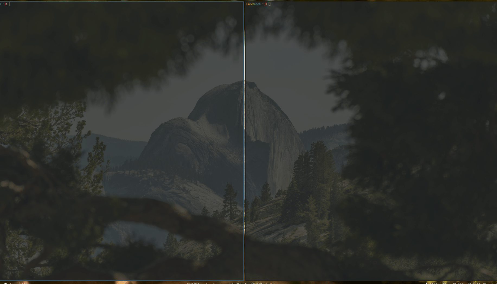

# Kevin's Arch Rice (KAR)
My hard-hitting arch linux / i3-gaps / polybar rice.
Clone it and watch this bad boy go.

## Features
* I tried to make all my scripts POSIX compliant where possible. I'm a beginner when it comes to POSIX scripting - let me know if you have problems on your platform or you see something that is definately not POSIX compliant.

### Polybar

* A minimalist but high information HUD like statusbar
* World Air Quality info in top left
	* my geoloc script (`~/.local/bin/tools/geoloc`) lets it work through a vpn (manual location setting)
* Weather
	* my geoloc script (`~/.local/bin/tools/geoloc`) lets it work through a vpn (manual location setting)
* Ethereum price (can be easily changed to any crypto tracked by coinmarketcap)
* See my `~/.config/polybar/config`

### Hotkeys that make sense
* Terminal
	* Spawn `$TERMINAL` at `$HOME`: mod+enter
	* Spawn `$TERMINAL` in directory of focused window: mod+shift+enter
	* rofi ssh: mod+shift+s(sh)
* Exiting/closing
	* Close a window (`kill`): mod+q(uit)
	* Close a window (`kill -9`): mod+shift+q(uit)
	* lock: mod+x
	* logout i3: mod+shift+y
	* shutdown: mod+shift+x
	* reboot: mod+shift+backspace
* Focus movement hotkeys
	* rofi window switch: mod+w(indow)
	* window focus movement: mod+{h|j|k|l}
	* floating/non-floating focus movement: mod+space
	* workplace focus movment: mod+{0-9}
	* workspace focus toggling: mod+{tab|backslash}
	* rofi workspace switching: mod+w(indow)
* Hotkeys having to do with i3/wm alteration include a shift:
	* window shifting: mod+shift+{h|j|k|l}
	* window hjkl resizing: mod+shift+{y|u|i|o}
	* window script resizing: mod+shift+r
	* floating/non-floating toggle (center, left, right): mod+shift+{space,b,n}
	* send window to workspace: mod+shift+{0-9}
	* window spawn vertical/horizontal: mod+shift+{apostrophe|slash}
	* toggle vertical/horizontal window spawn: mod+shift+t(oggle)
	* toggle sticky: mod+shift+g(lue)
	* toggle full screen: mod+shift+f(ull screen)
* Lowercase non-focus-movement commands launch programs:

	* floating xonsh: mod+c(alculator)
	* spawn `$FILE` manager: mod+f(ile manager)
	* spawn `$BROWSER`: mod+b(rowser)
	* qutebrowser web search: mod+s(earch)
	* qutebrowser buku bookmarks: mod+g(o to bookmark)
	* ncmpcpp (music): mod+m(usic)
	* pulsemixer (audio): mod+a(udio)
	* htop: mod+i(nfo)
	* rofi run: mod+r(un)
* For i3 hotkeys see `~/.config/i3/config`
* For other hotkeys see `~/.config/sxhkd/sxhkdrc`

### Qutebrowser

* Text file configuration at: ~/.config/qutebrowser/config.yml
	* Easier to version control and no need to modify a giant config.py
* rofi+buku+qutebrowser integration to manage bookmarks
	* standard qutebrowser bookmark management sucks
	* my rbuku script uses the powerful and browser agnostic [buku](https://github.com/jarun/Buku) to manage bookmarks with a [rofi](https://github.com/davatorium/rofi) interface
		- rbuku will work with any browser as long as it has a commandline interface to launch it; I use qutebrowser
	* qb-rbuku userscript wraps around my rbuku script (`~/.local/bin/uitools/rbuku`) to enable in-browser launching
		- :b / mod+g(o) -> go to a bookmark
		- :ba -> add current or hinted url as a bookmark
		- :br -> remove one or more bookmarks (disabled by default)
	* see config.yml `## ALIASES`
* A lot of search engine additions
	* youtube, ebay, arch wiki, various package manager and documentation search engines
	* :yt <search> -> search youtube for a video
	* mod+s(earch) -> open up rofi search engine prompt - go directly from the desktop to a search engine search (one step vs three steps)
	* see config.yml `## URL`
* More sensible tab movement
	* H and L move left and right through tabs
	* J and K move up and down through selected tab's history
	* h/j/k/l still scroll up/down/left/right in the selected tab
	* see config.yml `## KEYBINDS`
* Set base16 theming easily
	* Set `custom.base16.file` in config.yml to any base16 yaml file

### Redshift
* redshift starts at boot
* my geoloc script (`~/.local/bin/tools/geoloc`) lets it work through a vpn (manual location setting)
* redshift config at `~/.config/redshift/redshift.conf`

## TODO
* Set global theming from my directory of base16 files
	* Choose a theme from a rofi prompt and set base16 for:
		* Xresources (needs fixing)
		* qutebrowser
* replace dmenu with rofi
	* ~~rofi+buku+qutebrowser integration~~
		* rbuku -r (remove) disabled for now - qutebrowser adds an item which screws up indexing
		* can still delete with rofi by launching from the terminal via `rbuku -r`
	* ~~drive mounting/unmounting~~
* clean up home directory (move dotfiles elsewhere?)
* try out other login shells
	* zsh
	* tcsh
	* ksh
* test out other window managers
	* leftwm
	* xmonad
* cleanup and remove unused luke scripts
* lf config
	* ~~Change opener to open in a separate shell or the same window (as in ranger)~~
	* add a delete command
* improve my rss reader
	* install a new one?
	* organize feeds
* browsers
	* vimb
	* next

## Installation
1. Make sure you have all required programs installed
2. Clone this repo: `git clone git@github.com:kpatel28/KAR.git`
3. Populate submodules: `git submodule update --init --recursive`

## Details
* window manager: i3-gaps
* compositor: picom (compton)
* terminal: st
* terminal font: monospace
* bar: polybar
* bar icon: hack nerd font
* text editor: neovim
* file manager: lf+[pistol](https://github.com/doronbehar/pistol)
* notifications: dunst
* launcher: rofi
* music: ncmpcpp+mpd
* video: mpv
* hotkeys: sxhkd+i3
* browser: qutebrowser
* base16 theme: gruvbox

## Dependencies
* The latest version of [my scripts](https://github.com/kpatel28/scripts) as a git submodule dependency (built-in).
* The latest version of [my themes repo](https://github.com/kpatel28/themes) as a git submodule dependency (built-in).
* API Keys from [Coinmarketcap](https://coinmarketcap.com/api) and [World Air Quality Index](http://aqicn.org/data-platform/token/#/) ([Instructions](https://github.com/kpatel28/scripts/blob/master/polybar/README.md)).
* The programs these dotfiles rice.

## Big Thanks To
* [Luke Smith](https://github.com/LukeSmithxyz)
* [WillMe](https://github.com/WillemMe)

